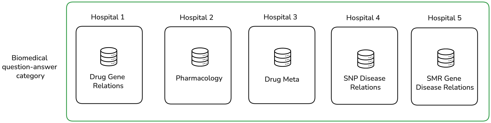
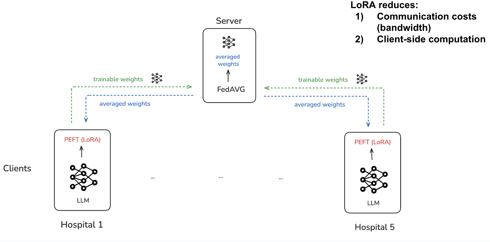

# Workshop: Federated LLM Fine-tuning

In this workshop we are using federated learning to fine-tune an LLM for generative question answering.   

## Dataset

We use the [CARDBiomedBench dataset](https://huggingface.co/datasets/NIH-CARD/CARDBiomedBench), available on Hugging Face. It contains question-answer pairs from the biomedical area. 

## LLM

We fine-tune the [SmolLM2](https://huggingface.co/HuggingFaceTB/SmolLM2-135M) base model, a decoder transformer model developed by Hugging Face. In this workshop, we use the 135M parameter model. 

## LoRA (Low Rank Adaptation)

Instead of fine-tuning all model parameters, we apply LoRA, a PEFT method that heavily reduces the number of trainable parameters. LoRA represents weight updates by two smaller matrices through low-rank decomposition. The original model weights remain frozen, while only these new matrices are trained. Read more about LoRA [here](https://huggingface.co/docs/peft/main/en/conceptual_guides/lora). 

## Use-Case

We consider the case where 5 hospitals hold question-answer pairs related to a different biomedical category. For regulatory reasons, the hospitals are not able to share their local data. Instead of each hospital fine-tuning their own LLM, they use **federated LLM fine-tuning** to collaboratively train a more capable model that generalizes across a broad range of biomedical question-answering tasks. 
That is because federated learning allows the model to be trained on the data from all hospitals, resulting in a model that has learned from a larger and more diverse dataset -- without sharing the data itself!



## Benefits of using Federated LLM fine-tuning with LoRA 

In federated learning, model parameters are exchanged between the clients and the server. By using LoRA, only the much smaller set of trainable parameters needs to be exchanged, significantly reducing communication overhead. Furthermore, LoRA reduces the computation cost for each client by requiring fewer parameters to be updated during training.



## Available Code

The *workshop_centralized.ipynb* notebook demonstrates how an LLM can be fine-tuned in a normal, centralized setting. 
On the other hand, the **workshop_federated_results.ipynb* notebook showcases the results in a federated setting. 

In the *client* folder you can find the code necessary to run federated fine-tuning with FEDn.  

## Running the Notebooks locally

If you want to run the notebooks on your own machine, you need to install the required libaries. 
Follow the steps below.

1. **Create a Virtual Environment**
   ```bash
   # Create a new virtual environment
   python -m venv .venv
   
   # Activate the virtual environment
   # On Windows
   .venv\Scripts\activate
   # On Unix or MacOS
   source .venv/bin/activate
   ```

2. **Install Dependencies**
   ```bash
   pip install -r requirements.txt
   ```


## Google Colab

Alternatively, you can run the workshop_centralized notebook on Google Colab. This will also give you GPU access.
The Google Colab notebook is available here: https://colab.research.google.com/drive/105dZCQC2U6BNbmf0hj7Mokq9Nk6j8WJH?authuser=1#scrollTo=tQmx_1ZKpzQL

In order to use it, follow these steps: 
1. Go to **File → Save a copy in Drive**
2. This will create your own personal copy you can edit and run.
